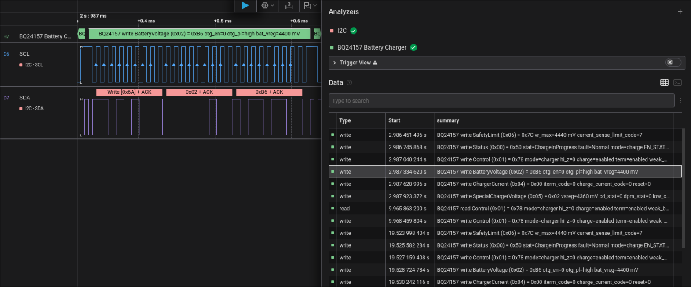

# BQ24157 Battery Charger HLA

Saleae Logic 2 High Level Analyzer for TI BQ24157 I2C traffic.

## Use

1. In Logic 2, open Extensions.
2. Add this folder as a local extension: `screenshots/bq24157_hla`.
3. Add the `BQ24157 Battery Charger` HLA above an I2C analyzer.
4. Leave `i2c_address` at `0` to use the default BQ24157 7-bit address `0x6A`, or set another 7-bit address.

The decoder recognizes:

- Register writes and write-then-read register reads
- `Status` charge state, boost/charge mode, and fault meanings
- `Control` mode, Hi-Z, charge-disable, termination, weak-battery threshold, and input limit
- Battery regulation voltage, revision, current-code, special charger voltage, CD/DPM/LOW_CHG, and safety-limit fields
